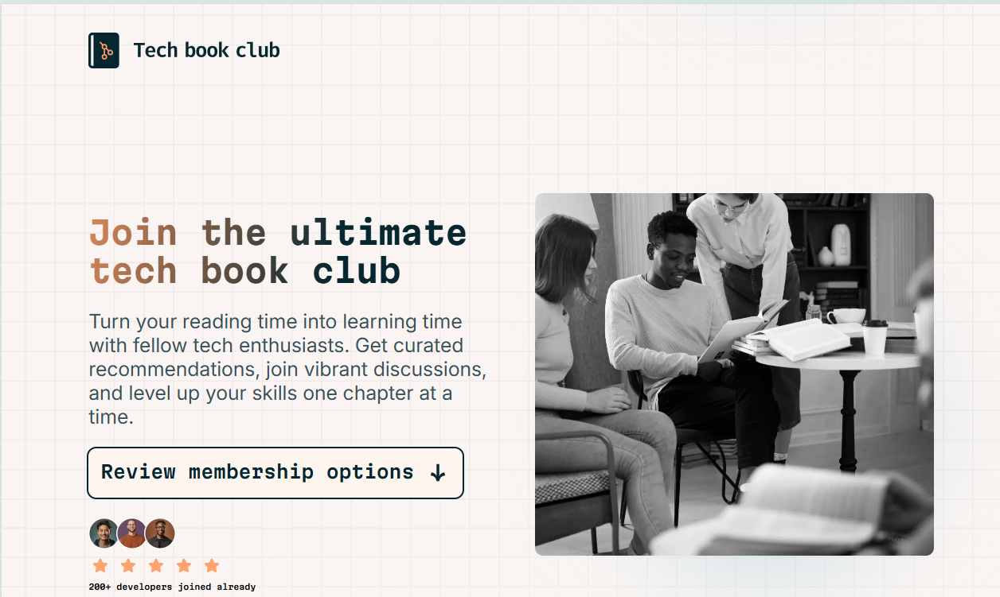

# Frontend Mentor - Tech book club landing page solution

This is a solution to the [Tech book club landing page challenge on Frontend Mentor](https://www.frontendmentor.io/challenges/tech-book-club-landing-page-fZQidjHU73). Frontend Mentor challenges help you improve your coding skills by building realistic projects.

## Table of contents

- [Overview](#overview)
  - [The challenge](#the-challenge)
  - [Screenshot](#screenshot)
  - [Links](#links)
- [My process](#my-process)
  - [Built with](#built-with)
  - [What I learned](#what-i-learned)
  - [Continued development](#continued-development)
  - [Useful resources](#useful-resources)
- [Author](#author)

## Overview

### The challenge

Users should be able to:

- View the optimal layout for the interface depending on their device's screen size
- See hover and focus states for all interactive elements on the page

### Screenshot



### Links

- Solution URL: [Add solution URL here](https://your-solution-url.com)
- Live Site URL: [Add live site URL here](https://your-live-site-url.com)

## My process

### Built with

- Semantic HTML5 markup
- CSS custom properties
- CSS scroll-driven animation(scroll timeline)
- Flexbox
- Mobile-first workflow

### What I learned

I learned how powerful can be scroll-driven-animation and how apply it on real project .

Code I'm proud of this

```#progress_bar{
    position: fixed;
    top: 0;
    left: 0;
    width: 100%;
    height: .5rem;
    background-image: linear-gradient(90deg, #FDBB2D 0%, #22C1C3 100%);
    transform-origin: 0% 50%;
    transform: scaleX(0);
    animation: loading cubic-bezier(0.4, 0, 1, 1);
    animation-timeline: --progress_loading;
    overflow: hidden;
    z-index: 22;
}

```

### Continued development

Starting to learn scroll driven animation with css only for better web performance but advanced concept to be really able to build awesome web page with great performance .

### Useful resources

- [MDN](https://developer.mozilla.org/fr/) - Amazing documentation that help me to revise semantic meaning of blockquote and Cite.
- [scroll-driven-animations](https://scroll-driven-animations.style/) - This is an amazing article which helped me finally understand scroll-driven animations especially timeline scroll . I'd recommend it to anyone still learning this concept.

## Author

- linkedin - [GabrielNgoh](https://www.your-site.com)
- Frontend Mentor - [@ngohbuilds](https://www.frontendmentor.io/profile/NgohBuilds)
